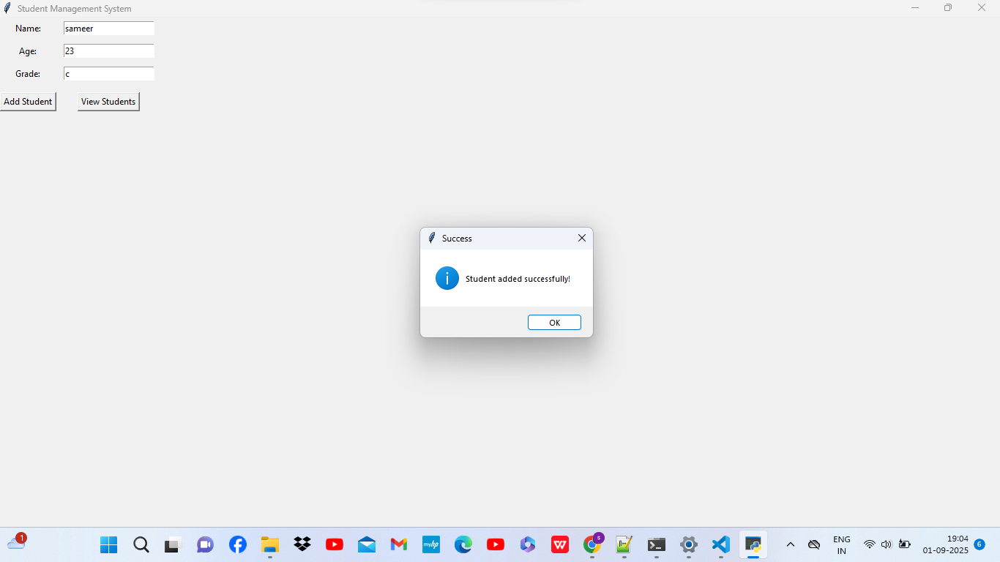
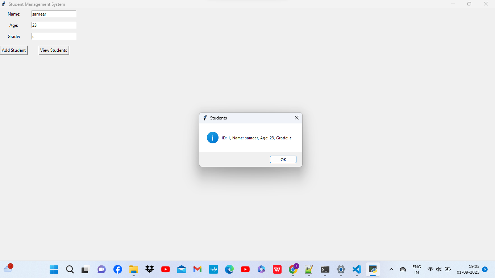

# Student Management GUI

A simple **Student Management System** built using **Python (Tkinter + SQLite3)**.  
This project allows users to **add, view, update, and delete student records** with a user-friendly interface.

---

## Features
- Add a new student with **Name, Age, and Grade**  
- View all student records in a table format  
- Update existing student details  
- Delete student records  
- Data is stored in **SQLite3 database**  

---

## Technologies Used
- Python 3  
- Tkinter (for GUI)  
- SQLite3 (for database)  

---

## Screenshots
_Add screenshots of the project UI here_  
(Place them inside a `screenshots/` folder and link them below)

Example:  
  
  

---

## How to Run
1. Clone the repository:
   ```bash
   git clone https://github.com/username/student-management-gui.git
   
   
 Navigate to the project folder:
 
 cd student-management-gui


Run the project:
python main.py


Future Enhancements

Add search functionality

Export student records to Excel/CSV

Login system for admin

Author

Developed by Suraj Jadhav   
